[TOC]

# 移动语义

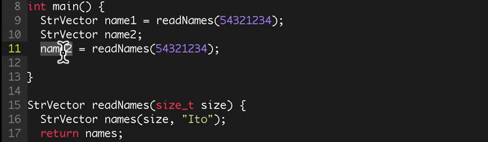

以上过程共有六个变量被构造、析构

name1 调用 readNames ，创建names变量，函数结束析构

line17 return 处创建StrVector，拷贝names，在line9通过拷贝构造函数传递给name1，随后析构

name1 在main函数结束后析构

**移动语义**会在拷贝函数生效时，如果右值即将析构，左值将会取右值而代之，**降低一次拷贝、析构、构造的开销**

## 左值与右值

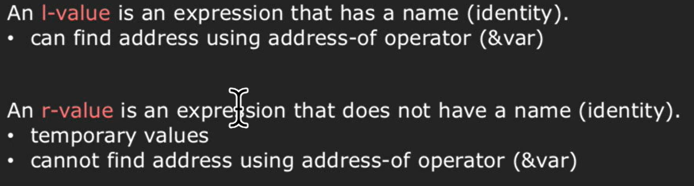

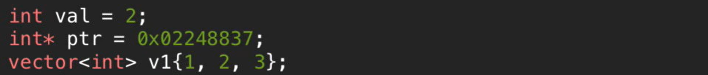

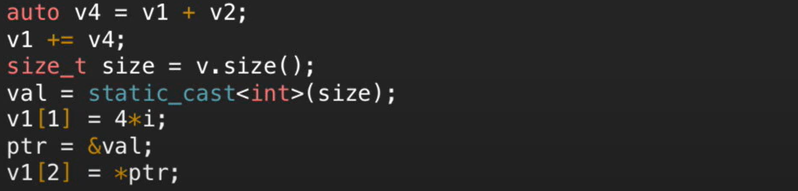

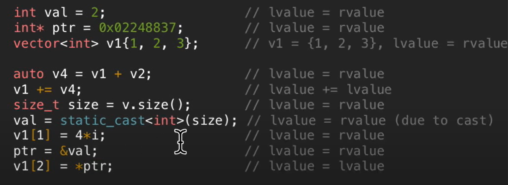

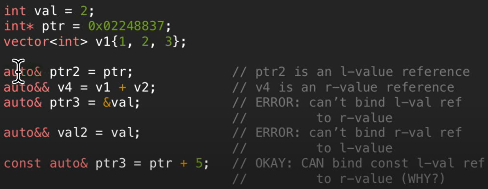

## 移动语义成员函数

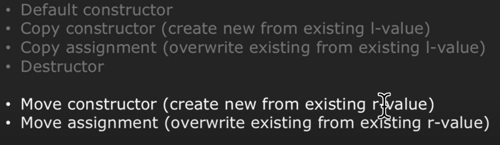

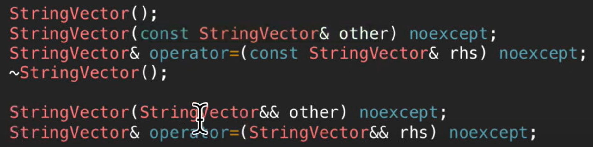

## 移动语义成员函数实现

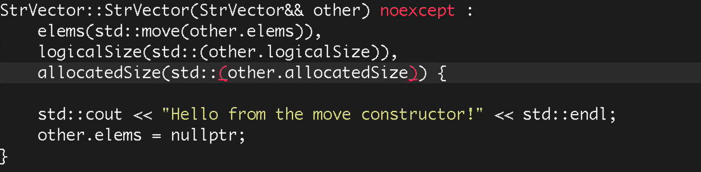

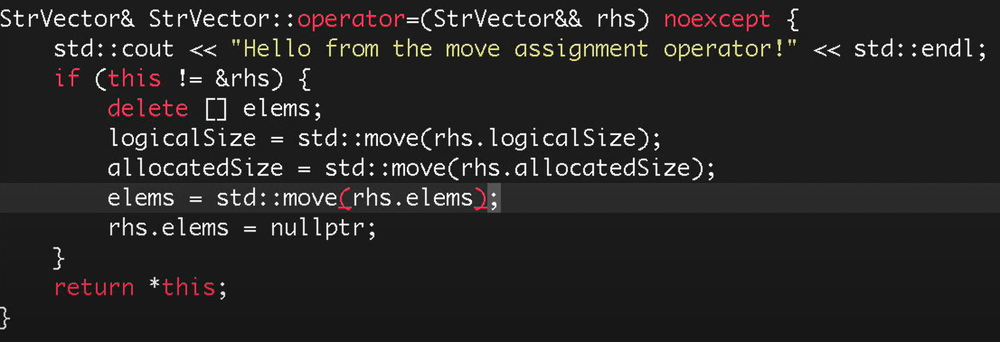

## 性能测试

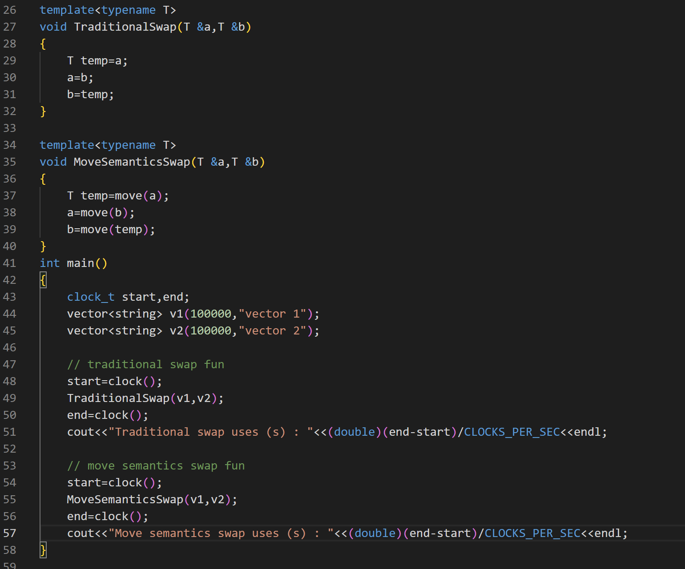

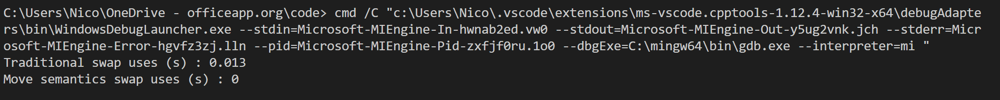

