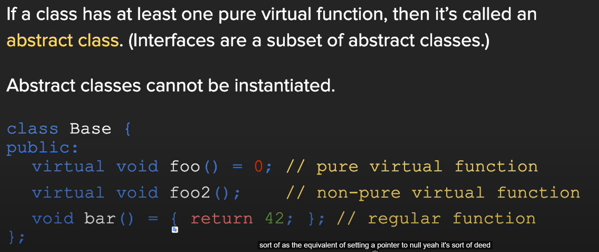
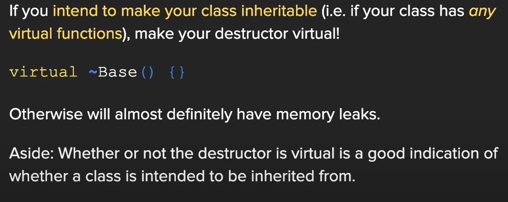
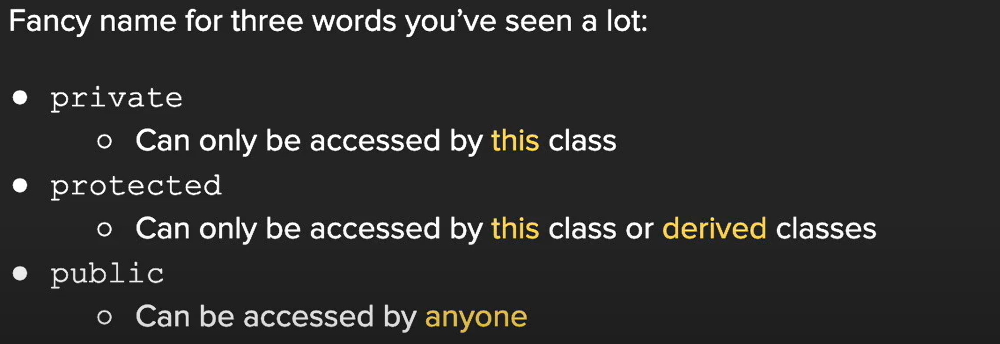
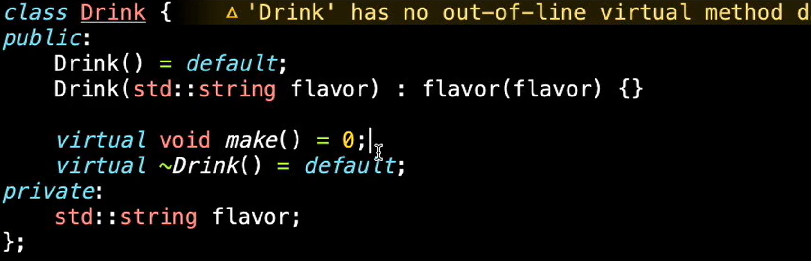
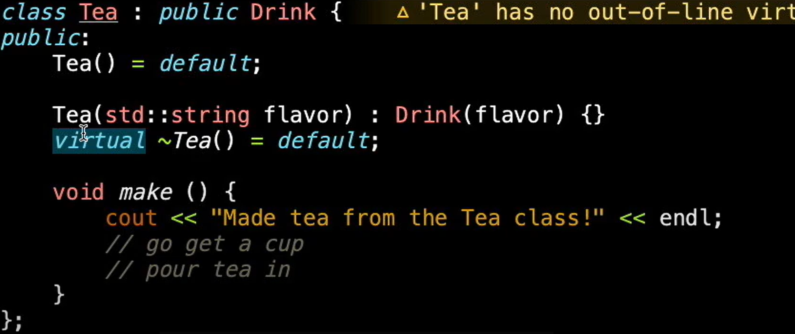
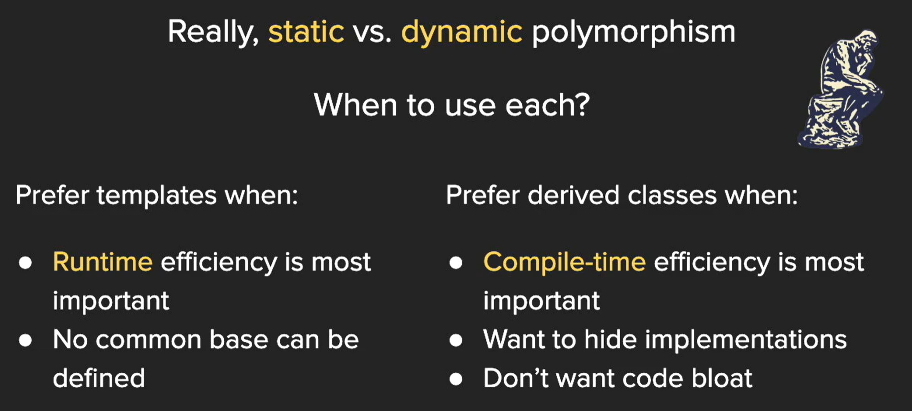
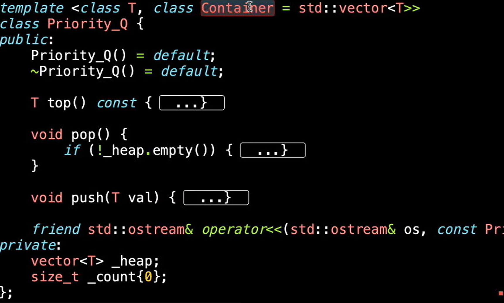

[TOC]

# 继承



1. 纯虚函数：派生类必须提供实现。
2. 非纯（普通）虚函数：派生类可以生成自己的实现方式，若不提供则使用基类的实现方式。
3. 普通函数：表明派生类不应该更改该实现。



基类析构函数需要写成 虚函数形式，不然会有内存泄露风险



## 继承类示例





```c++
int main()
{
	Tea t;
	t.make();		//调用子类接口
	t.Drink::make(); //调用父类接口
}
```

## Template 与 继承类 比较



# Template Class

vector list 的实现方式



