[TOC]

# RAII

## WHY 

### code paths

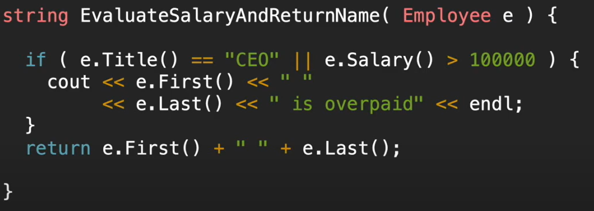

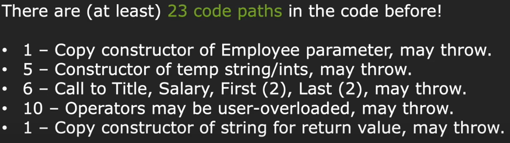

``` c++
string EvaluateSalaryAndReturnName(int idNumber)
{
    Employee *e = newEmployee(idNumber);

    if (e->Title == "CEO" || e->Salary() > 100000)
    {
        cout << e->First() << " "
             << e->Last() << " is overpaid" << endl;
    }
    auto result = e->First() + " " + e->Last();

    delete e;
    return result;
}
```

如果在以上23个代码分支中，任意一个分支出错，delete都无法执行，造成内存泄漏。

### 需要申请、释放的资源


### 程序安全等级分类

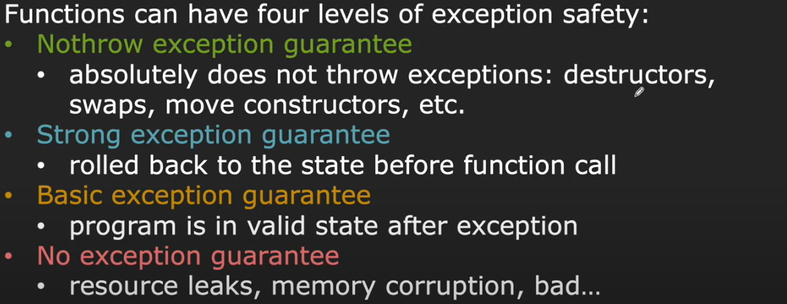

## WHAT IS RAII / CADRE

**Resource Acuisition Is Initialization** / **Constructor Acquires, Destructor Releases**

RAII : 所有的资源申请应该在构造函数完成，所有资源释放应在析构函数完成

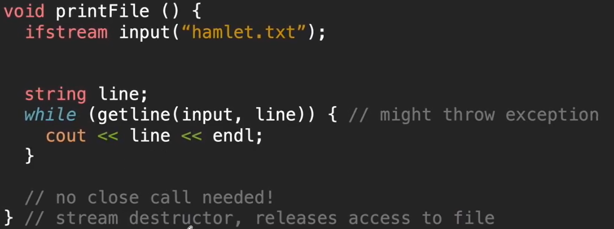

stream类型符合RAII要求，即便没有close()，在对象结束时也会调用析构函数自动释放资源

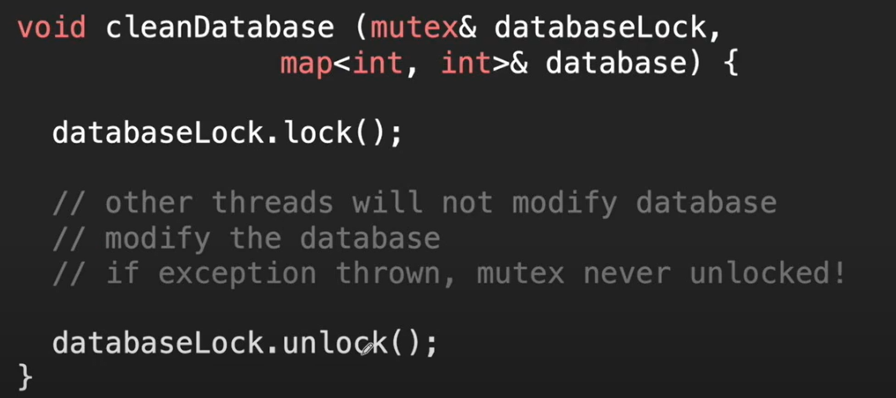

不符合RAII

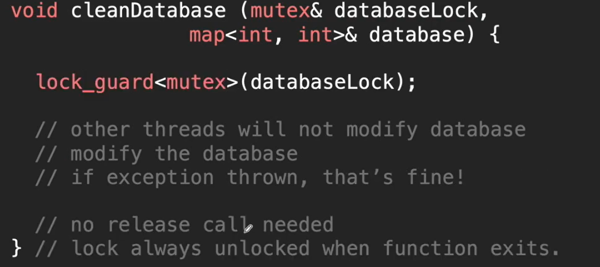

符合RAII，防止内存泄漏

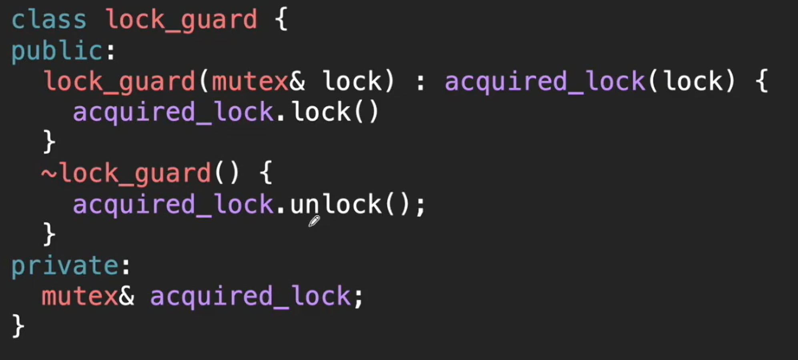

==lock_guard==实现方式

## HOW - 智能指针

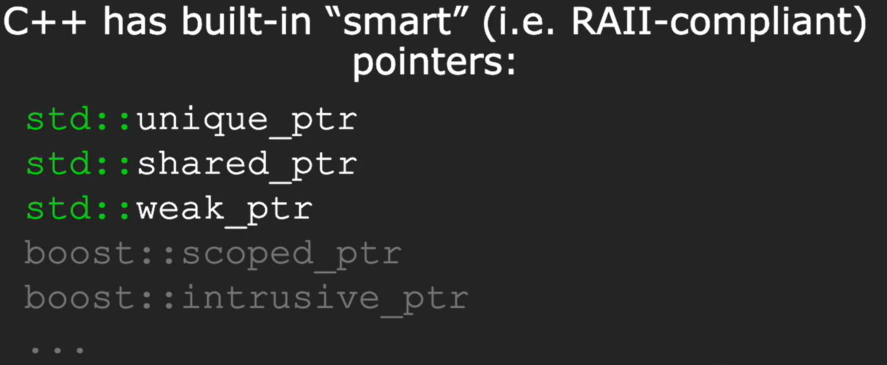

### unique_ptr

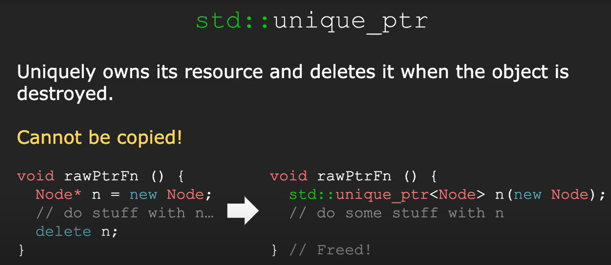

==unique_ptr==通过==lock_guard==实现不能复制

### shared_ptr

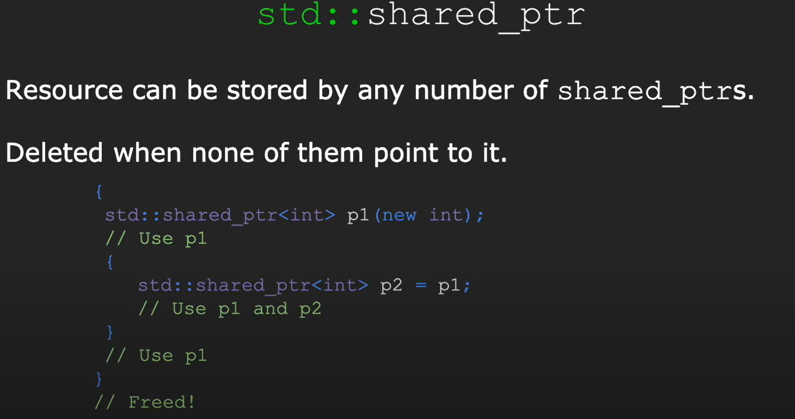

==shared_ptr==可以对资源进行复制

==shared_ptr==实现原理

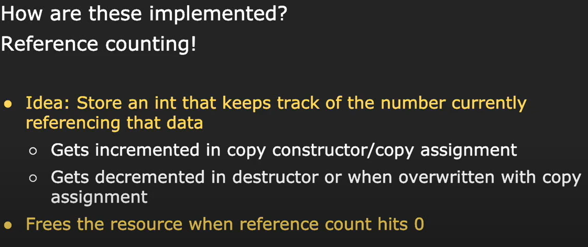

### weak_ptr

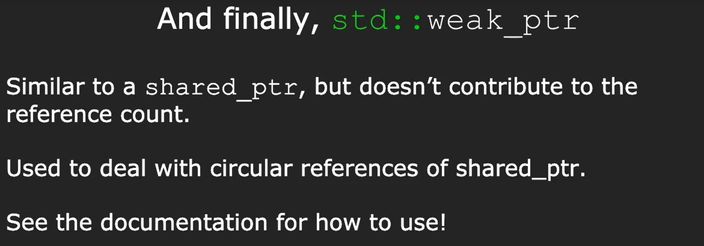

==weak_ptr==解决==shared_ptr==的循环引用问题


