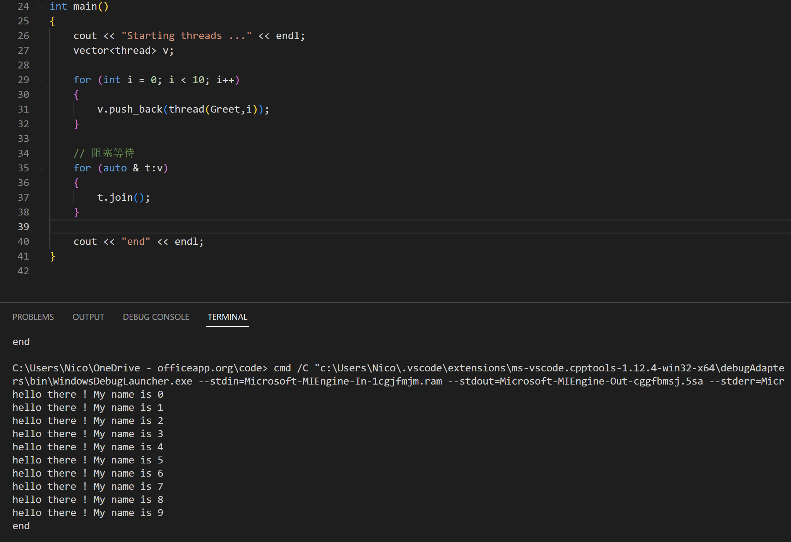

[TOC]

# 多线程

## WHY

同一个进程中需要同时完成不同的任务

## WHAT

在一个进程中同时运行了多个线程，用来完成不同的工作，则称之为“多线程”，多个线程交替占用cpu资源，而非真正的并行执行。

## HOW

``` c++
mutex mtx;

void Greet(int id)
{
    lock_guard<mutex> lg(mtx);          // lock_guard : RAII
    cout << "hello there ! My name is " << id << endl;
}

int main()
{
    cout << "Starting threads ..." << endl;

    thread t1(Greet, 1);
    thread t2(Greet, 2);

    // 阻塞等待
    t1.join();
    t2.join();

    cout << "end" << endl;
}
```

